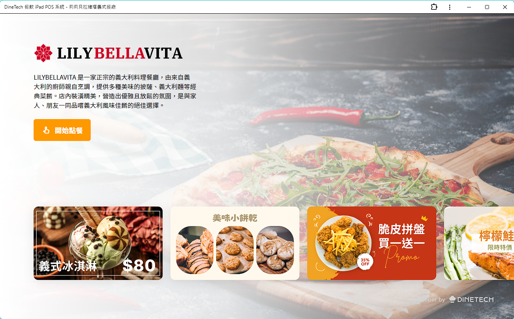
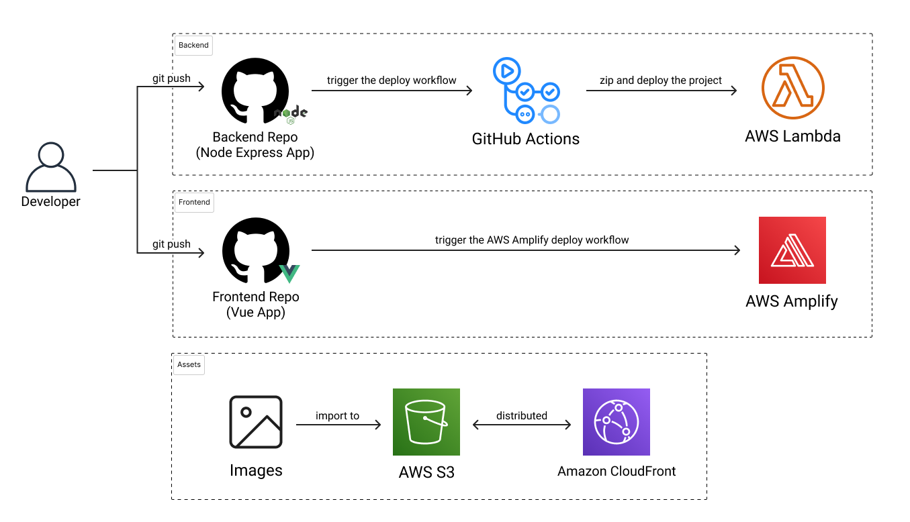
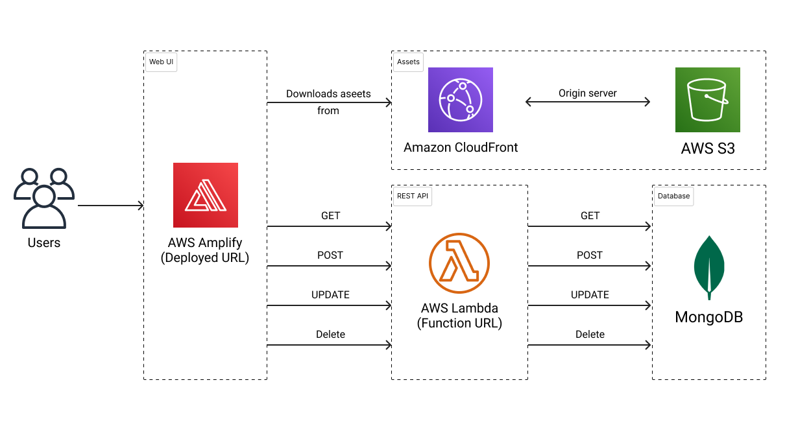

# [DineTech 餐飲 iPad POS 系統](https://main.d1i05uiq01rayp.amplifyapp.com/)

專為小型餐飲業者設計的 iPad POS 點餐系統，網站包含企業形象官網，並提供了虛擬餐廳「莉莉貝拉維塔義式餐廳」的系統展示頁面。

關鍵字：Vue, Vite, Pinia, Tailwind CSS, TypeScript, POS, PWA, AWS Amplify, 金流串接

  

  

## 目錄

- [網站介紹](#網站介紹)
- [網站設計](#網站設計)
  - [線稿圖](#線稿圖)
  - [路由設計](#路由設計)
- [專案設計](#專案設計)
  - [程式架構](#程式架構)
- [系統設計](#系統設計)
  - [Deployment Dependency](#deployment-dependency)
  - [Runtime Dependency](#runtime-dependency)
- [使用技術與工具](#使用技術與工具)
  - [設計相關](#設計相關)
  - [前端開發相關](#前端開發相關)
- [關於作者](#關於作者)
- [License](#License)

---

## 網站介紹

- 網站名稱：DineTech 餐飲 iPad POS 系統
- 架站目的：本網站旨在介紹餐飲 POS 系統的營銷方案，並為潛在客戶提供專業諮詢、應用實例分享以及技術支援等內容，以協助店家提升銷售額。
- 目標客群：小型餐飲企業，如餐廳、咖啡廳等。
- 網站特色：網站包含企業形象官網，並提供了虛擬餐廳「莉莉貝拉維塔義式餐廳」的系統展示頁面。

---

## 網站設計

### 線稿圖

[Figma 連結](https://www.figma.com/design/lFt6jwme8xNuks6pFJekZi/DineTech-%E9%A4%90%E9%A3%B2%E7%B3%BB%E7%B5%B1---Wireframe?node-id=0-1&t=srd40wSFif51hq5r-1)

### 路由設計

[路由表連結](https://main.d1i05uiq01rayp.amplifyapp.com/routes)

---

## 專案設計

### 程式架構

<pre>
|- public               # 由網頁伺服器直接提供的公共資源
|- src                  # 應用程式的源文件
 |  |- apis             # API 服務函數
 |  |- assets           # 靜態資源如圖像和樣式
 |  |- components       # Vue 組件
 |  |- data             # 靜態數據文件
 |  |- interfaces       # TypeScript 介面和類型
 |  |- mixins           # Vue 混入
 |  |- router           # 用於路由的 Vue Router 文件
 |  |- stores           # 用於狀態管理的 Pinia 存儲
 |  |- utils            # 工具函數
 |  |- views            # 表示頁面的 Vue 組件
 |  |- App.vue          # 根 Vue 組件
 |  |- main.ts          # 應用程式的入口點
|- .eslintrc.cjs        # CommonJS 格式的 ESLint 配置
|- .gitignore           # 指定有意忽略的未追蹤文件
|- .prettierrc.json     # Prettier 配置文件
|- .env.d.ts            # 環境變量的 TypeScript 聲明文件
|- example.env          # 環境變量示例文件
|- index.html           # 入口 HTML 文件
|- manifest.json        # Web 應用程式清單
|- package.json         # NPM 包配置
|- package-lock.json    # NPM 依賴的自動生成文件
|- postcss.config.ts    # PostCSS 配置
|- README.md            # 項目文檔
|- tailwind.config.ts   # Tailwind CSS 配置
|- tsconfig.app.json    # 應用程式的 TypeScript 配置
|- tsconfig.json        # 基本的 TypeScript 配置
|- tsconfig.node.json   # Node.js 的 TypeScript 配置
|- tsconfig.vitest.json # Vitest 的 TypeScript 配置
|- vite.config.ts       # Vite 構建工具配置
|- vitest.config.ts     # Vitest 測試框架配置
</pre>

## 系統設計

### Deployment Dependency

### Runtime Dependency

### 使用技術與工具

### 設計相關

- [Figma](https://www.figma.com/)

### 前端開發相關

- [Vue 3](https://vuejs.org/)
- [Vue Router](https://router.vuejs.org/)
- [VeeValidate](https://vee-validate.logaretm.com/v4/)
- [Vite](https://vitejs.dev/)
- [Vite PWA](https://vite-pwa-org.netlify.app/)
- [Pinia](https://pinia.vuejs.org/)
- [TypeScript](https://www.typescriptlang.org/)
- [Tailwind CSS](https://tailwindcss.com/)
- [axios](https://github.com/axios/axios)
- [Lodash](https://lodash.com/)
- [swiper](https://github.com/nolimits4web/Swiper)
- [material-icons](https://github.com/marella/material-icons)
- [Prettier](https://prettier.io/)
- [ESLint](https://eslint.org/)

---

## 關於作者

Sam Chiu [(LinkedIn)](https://www.linkedin.com/in/sam-chiu-4b7557137/)

本作品僅供個人學習及交流使用。若您對本作品有任何疑問或想法，歡迎來信讓我知道。

  

---

## License

Copyright © 2024 Sam Chiu. All rights reserved.
